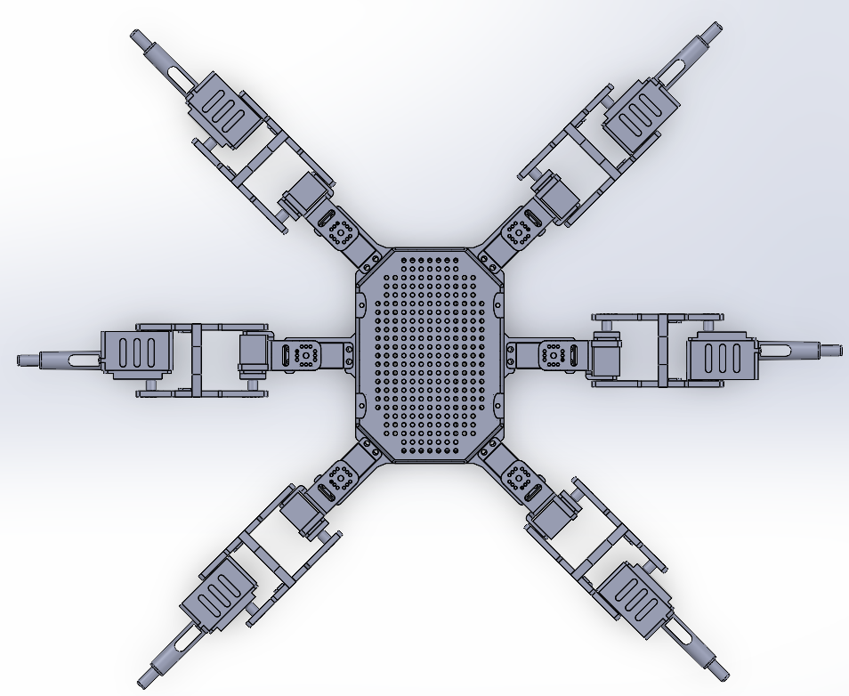

# QueueHexa

## Purpose
This is a personal robotics project created to hone my skills in CAD, electronics, and embedded programming. The idea is to design and build a six-legged hexapod robot from scratch: modeling, selecting the electronics, and programming custom inverse kinematics and gait control.

## Project Status
**In Development**

Planned improvements:
  - Add an accelerometer for motion/orientation feedback
  - Add leg position sensors
  - Integrate LiDAR for environmental sensing

## Hardware
  - Arduino Uno
  - PCA9685 servo driver(s)
  - MG996R servos
  - 35 kg high-torque servos
  - 7.4 V 5200 mAh battery
  - YPG 20A HV SBEC

## Development Journey
  Throughout the project, designing a reliable leg was one of the biggest challenges. The basic CAD process was simple; however, experimenting with the design in real life took multiple attempts before the leg was finally strong enough.
  
  For instance, the leg's joint went through two major changes: adding a peg and reinforcing the sides. These small details were overlooked in my initial design; however, their addition took the robot from crumbling under its own weight to being able to stand with only three of its legs.
  
  The hexapod's body also went through a similar process, however, with most changes aimed to minimize the usage of screws while considering space for electronics.
  
  The initial design was aimed to maximize modularity: the leg can be dissembled from the body plate was its own parts. However, the constant re-screwing made maintenance exhausting. With the 2nd prototypes, the layout changed from utilizing plates to a strong central frame, reducing the required screws to 4.
